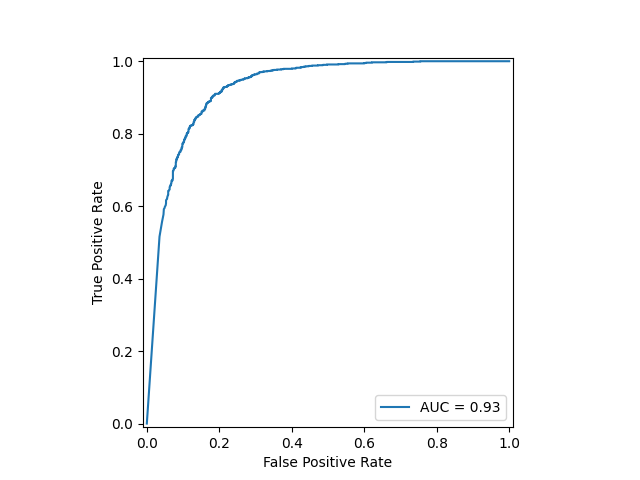

# CNN-Image-Classifier-and-CLI-tool

A Convolutional Neural Network for classifying an image as a cat or a dog. The CNN was built using PyTorch and its architecture was inspired by [VGG16](https://arxiv.org/abs/1409.1556) and [ResNet](https://arxiv.org/abs/1512.03385). This model is not intended to achieve state of the art performance, but rather as 
a side-project to work on my machine-learning skills.

In addition, I've created a simple CLI based tool to easily use the trained model to classify any provided image. The CLI tool can be used by cloning the repository and running:

```
python cli_app.py --path [image path]
```
An optional `--gpu` flag can be provided if you would like to utilise your NVIDIA GPU for computation.

## Training

The training was conducted using 10000, 32x32 resolution cat and dog images from the [CIFAR-10](https://www.cs.toronto.edu/~kriz/cifar.html) dataset. Furthermore a simple data augmentation procedure was conducted (as suggested in the [*Deepl-Supervised Nets*](https://arxiv.org/abs/1409.5185) paper), consisting of a random horizontal flip, followed by a four pixel padding, and then a random 32x32 square crop.


## Performance

The current iteration of the trained model obtains an AUC of 0.93 (see images in `trained_models/res_net_18/` for more performance data). Currently the model is quite simple due to personal hardware limitations; it is likely that with access to better hardware the performance of the 
CNN can be improved substantially. 



## Future Improvements

I would like to try incorporating ideas from the *Inception module* outlined in the paper, [*Going deeper with convolutions*](https://arxiv.org/abs/1409.4842).
